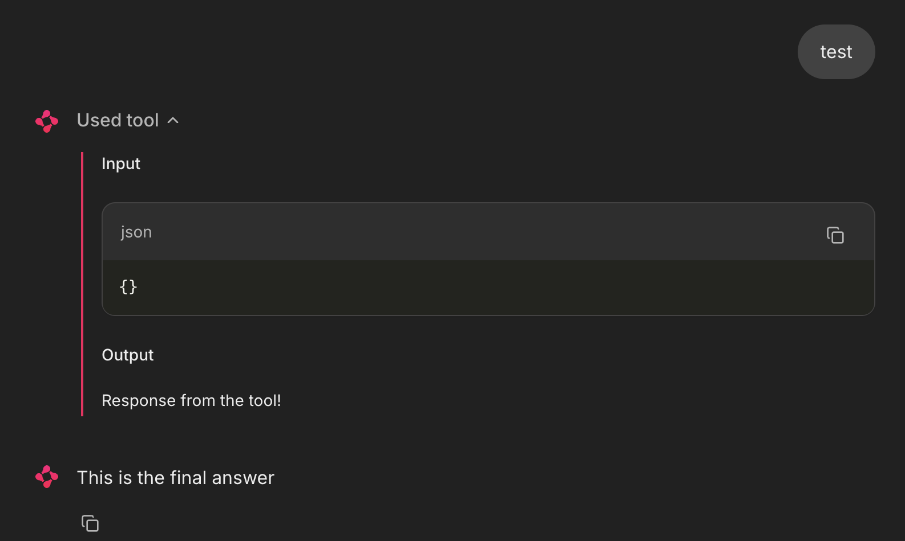
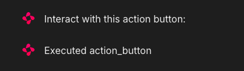
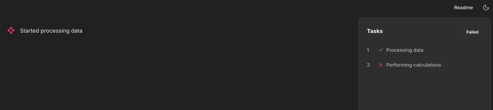

# Chainlit

Chainlit is an open-source Python package to build production ready Conversational AI.

## Intro
Key features
- Build fast: Get started in a couple lines of Python
- Authentication: Integrate with corporate identity providers and existing authentication infrastructure
- Data persistence: Collect, monitor and analyze data from your users
- Visualize multi-steps reasoning: Understand the intermediary steps that produced an output at a glance
- Multi Platform: Write your assistant logic once, use everywhere

Chainlit is compatible with all Python programs and libraries. That being said, it comes with a set of integrations with popular libraries and frameworks:
- langchain
- openai
- mistralai
- autogen
- llama index

## Installation
```bash
pip install chainlit
```

or
```bash
uv add chainlit
```

## Usage
Run the Chainlit app in watch mode:
```bash
chainlit run <app> -w
```

## Chat Lifecycle
Whenever a user connects to your Chainlit app, a new chat session is created. A chat session goes through a life cycle of events, which you can respond to by defining hooks.

### 1. ​On Chat Start
The `on_chat_start` decorator is used to define a hook that is called when a new chat session is created.

```python
@cl.on_chat_start
def on_chat_start():
    print("A new chat session has started!")
```

### 2. On Message
The `on_message` decorator is used to define a hook that is called when a new message is received from the user.
```python
@cl.on_message
def on_message(msg: cl.Message):
    print("The user sent: ", msg.content)
```

### 3. On Stop
The `on_stop` decorator is used to define a hook that is called when the user clicks the stop button while a task was running.
```python
@cl.on_stop
def on_stop():
    print("The user wants to stop the task!")
```

### 4. On Chat End
The `on_chat_end` decorator is used to define a hook that is called when the chat session ends either because the user disconnected or started a new chat session.
```python
@cl.on_chat_end
def on_chat_end():
    print("The user disconnected!")
```

### 5. On Chat Resume
The on_chat_resume decorator is used to define a hook that is called when a user resumes a chat session that was previously disconnected. This can only happen if authentication and data persistence are enabled.
```python
from chainlit.types import ThreadDict

@cl.on_chat_resume
async def on_chat_resume(thread: ThreadDict):
    print("The user resumed a previous chat session!")
```

## Starters
Starters are suggestions to help your users get started with your assistant.
```python
import chainlit as cl

@cl.set_starters
async def set_starters():
    return [
        cl.Starter(
            label="Morning routine ideation",
            message="Can you help me create a personalized morning routine that would help increase my productivity throughout the day? Start by asking me about my current habits and what activities energize me in the morning.",
            icon="/public/idea.svg",
            ),

        cl.Starter(
            label="Explain superconductors",
            message="Explain superconductors like I'm five years old.",
            icon="/public/learn.svg",
            ),
        cl.Starter(
            label="Python script for daily email reports",
            message="Write a script to automate sending daily email reports in Python, and walk me through how I would set it up.",
            icon="/public/terminal.svg",
            ),
        cl.Starter(
            label="Text inviting friend to wedding",
            message="Write a text asking a friend to be my plus-one at a wedding next month. I want to keep it super short and casual, and offer an out.",
            icon="/public/write.svg",
            )
        ]
# ...
```
This is how the 4 `Starter` above look like:


## Message
A Message is a piece of information that is sent from the user to an assistant and vice versa. Coupled with life cycle hooks, they are the building blocks of a chat.

A message has a content, a timestamp and cannot be nested.

​### Example: Reply to a user message
Lets create a simple assistant that replies to a user message with a greeting.
```python
import chainlit as cl

@cl.on_message
async def on_message(message: cl.Message):
    response = f"Hello, you just sent: {message.content}!"
    await cl.Message(response).send()
```


### Chat Context
Since LLMs are stateless, you will often have to accumulate the messages of the current conversation in a list to provide the full context to LLM with each query.

You could do that manually with the `user_session`. However, Chainlit provides a built-in way to do this:
```python
import chainlit as cl

@cl.on_message
async def on_message(message: cl.Message):
    # Get all the messages in the conversation in the OpenAI format
    print(cl.chat_context.to_openai())

    # Send the response
    response = f"Hello, you just sent: {message.content}!"
    await cl.Message(response).send()
```

Every message sent or received will be automatically accumulated in cl.chat_context. You can then use `cl.chat_context.to_openai()` to get the conversation in the OpenAI format and feed it to the LLM.


## Step
LLM powered Assistants take multiple steps to process a user’s request, forming a chain of thought. Unlike a Message, a Step has a type, an input/output and a start/end.

Depending on the config.ui.cot setting, the full chain of thought can be displayed in full, hidden or only the tool calls.

### A Simple Tool Calling Example
Lets take a simple example of a Chain of Thought that takes a user’s message, process it and sends a response.### 
```python
import chainlit as cl


@cl.step(type="tool")
async def tool():
    # Simulate a running task
    await cl.sleep(2)

    return "Response from the tool!"


@cl.on_message
async def main(message: cl.Message):
    # Call the tool
    tool_res = await tool()

    # Send the final answer.
    await cl.Message(content="This is the final answer").send()
```

To run the above:
```bash
chainlit run app/app_tool_calling_step.py
```
And this is how it appears:


#### Access the Current step
You can access the current step object using `cl.context.current_step` and override values.
```python
import chainlit as cl

@cl.step
async def my_step():
    current_step = cl.context.current_step

    # Override the input of the step
    current_step.input = "My custom input"

    # Override the output of the step
    current_step.output = "My custom output"
```


### Step API
There are two ways to create steps, either by using the the `@cl.step` decorator or by using the `cl.Step` class.

#### Step Decorator
The step decorator will log steps based on the decorated function. By default, the arguments of the function will be used as the input of the step and the return value will be used as the output.
Under the hood, the step decorator is using the `cl.Step` class.

### Nest Steps
If another step decorated function is called inside the decorated function, the child step will be nested under the parent step.

```python
import chainlit as cl

@cl.step
async def parent_step():
    await child_step()
    return "Parent step output"

@cl.step
async def child_step():
    return "Child step output"

@cl.on_chat_start
async def main():
    await parent_step()
```

## Action
The Action class is designed to create and manage actions to be sent and displayed in the chatbot user interface. Actions consist of buttons that the user can interact with, and these interactions trigger specific functionalities within your app.

### USage
```python
import chainlit as cl

@cl.action_callback("action_button")
async def on_action(action):
    await cl.Message(content=f"Executed {action.name}").send()
    # Optionally remove the action button from the chatbot user interface
    await action.remove()

@cl.on_chat_start
async def start():
    # Sending an action button within a chatbot message
    actions = [
        cl.Action(name="action_button", payload={"value": "example_value"}, label="Click me!")
    ]

    await cl.Message(content="Interact with this action button:", actions=actions).send()
```

To execute the above, run
```baash
chainlit run app/app_usage_button.py
```

This will show the below:


Upon clicking:




## Chat Profiles
Decorator to define the list of chat profiles.
If authentication is enabled, you can access the user details to create the list of chat profiles conditionally.
The icon is optional.

### Usage
```python
import chainlit as cl


@cl.set_chat_profiles
async def chat_profile():
    return [
        cl.ChatProfile(
            name="GPT-3.5",
            markdown_description="The underlying LLM model is **GPT-3.5**.",
            icon="https://picsum.photos/200",
        ),
        cl.ChatProfile(
            name="GPT-4",
            markdown_description="The underlying LLM model is **GPT-4**.",
            icon="https://picsum.photos/250",
        ),
    ]

@cl.on_chat_start
async def on_chat_start():
    chat_profile = cl.user_session.get("chat_profile")
    await cl.Message(
        content=f"starting chat using the {chat_profile} chat profile"
    ).send()
```

With authentication:
```python
from typing import Optional

import chainlit as cl


@cl.set_chat_profiles
async def chat_profile(current_user: cl.User):
    if current_user.metadata["role"] != "ADMIN":
        return None

    return [
        cl.ChatProfile(
            name="GPT-3.5",
            markdown_description="The underlying LLM model is **GPT-3.5**, a *175B parameter model* trained on 410GB of text data.",
        ),
        cl.ChatProfile(
            name="GPT-4",
            markdown_description="The underlying LLM model is **GPT-4**, a *1.5T parameter model* trained on 3.5TB of text data.",
            icon="https://picsum.photos/250",
        ),
        cl.ChatProfile(
            name="GPT-5",
            markdown_description="The underlying LLM model is **GPT-5**.",
            icon="https://picsum.photos/200",
        ),
    ]


@cl.password_auth_callback
def auth_callback(username: str, password: str) -> Optional[cl.User]:
    if (username, password) == ("admin", "admin"):
        return cl.User(identifier="admin", metadata={"role": "ADMIN"})
    else:
        return None


@cl.on_chat_start
async def on_chat_start():
    user = cl.user_session.get("user")
    chat_profile = cl.user_session.get("chat_profile")
    await cl.Message(
        content=f"starting chat with {user.identifier} using the {chat_profile} chat profile"
    ).send()
```

## Element
Text messages are the building blocks of a chatbot, but we often want to send more than just text to the user such as images, videos, and more.

That is where elements come in. Each element is a piece of content that can be attached to a Message or a Step and displayed on the user interface.

### Image Element
The Image class is designed to create and handle image elements to be sent and displayed in the chatbot user interface. You must provide either an url or a path or content bytes.

Example:
```python
import chainlit as cl


@cl.on_chat_start
async def start():
    image = cl.Image(path="./cat.jpeg", name="image1", display="inline")

    # Attach the image to the message
    await cl.Message(
        content="This message has an image!",
        elements=[image],
    ).send()
```

### Dataframe element
The Dataframe class is designed to send a pandas dataframe to the chatbot user interface.
```python
import pandas as pd

import chainlit as cl


@cl.on_chat_start
async def start():
    # Create a sample DataFrame with more than 10 rows to test pagination functionality
    data = {
        "Name": [
            "Alice",
            "David",
            "Charlie",
            "Bob",
            "Eva",
            "Grace",
            "Hannah",
            "Jack",
            "Frank",
            "Kara",
            "Liam",
            "Ivy",
            "Mia",
            "Noah",
            "Olivia",
        ],
        "Age": [25, 40, 35, 30, 45, 55, 60, 70, 50, 75, 80, 65, 85, 90, 95],
        "City": [
            "New York",
            "Houston",
            "Chicago",
            "Los Angeles",
            "Phoenix",
            "San Antonio",
            "San Diego",
            "San Jose",
            "Philadelphia",
            "Austin",
            "Fort Worth",
            "Dallas",
            "Jacksonville",
            "Columbus",
            "Charlotte",
        ],
        "Salary": [
            70000,
            100000,
            90000,
            80000,
            110000,
            130000,
            140000,
            160000,
            120000,
            170000,
            180000,
            150000,
            190000,
            200000,
            210000,
        ],
    }

    df = pd.DataFrame(data)

    elements = [cl.Dataframe(data=df, display="inline", name="Dataframe")]

    await cl.Message(content="This message has a Dataframe", elements=elements).send()
```

### File Element
The File class allows you to display a button that lets users download the content of the file.
```python
import chainlit as cl


@cl.on_chat_start
async def start():
    elements = [
        cl.File(
            name="hello.py",
            path="./hello.py",
            display="inline",
        ),
    ]

    await cl.Message(
        content="This message has a file element", elements=elements
    ).send()
```

### Task list element
The `TaskList` class allows you to display a task list next to the chatbot UI.
The TaskList element is slightly different from other elements in that it is not attached to a Message or Step but can be sent directly to the chat interface.

Example code:
```python
import chainlit as cl


@cl.on_chat_start
async def main():
    # Create the TaskList
    task_list = cl.TaskList()
    task_list.status = "Running..."

    # Create a task and put it in the running state
    task1 = cl.Task(title="Processing data", status=cl.TaskStatus.RUNNING)
    await task_list.add_task(task1)
    # Create another task that is in the ready state
    task2 = cl.Task(title="Performing calculations")
    await task_list.add_task(task2)

    # Optional: link a message to each task to allow task navigation in the chat history
    message = await cl.Message(content="Started processing data").send()
    task1.forId = message.id

    # Update the task list in the interface
    await task_list.send()

    # Perform some action on your end
    await cl.sleep(1)

    # Update the task statuses
    task1.status = cl.TaskStatus.DONE
    task2.status = cl.TaskStatus.FAILED
    task_list.status = "Failed"
    await task_list.send()
```

```bash
chainlit run app/app_task_list.py
```




---
## Demo scripts

### OpenAI Integration english to Spanish Translation
This app shows how to use an Openai model, in this case `gpt-3.5-turbo`

```bash
chainlit run app/app_openai_translate.py -w
```

Prompt Example:


Input and Output:


## More resources
- **Documentation:** Get started with our comprehensive [Chainlit Documentation](https://docs.chainlit.io) 📚
- **Discord Community:** Join our friendly [Chainlit Discord](https://discord.gg/k73SQ3FyUh) to ask questions, share your projects, and connect with other developers! 💬

- [Chainlit Cookbook](https://github.com/Chainlit/cookbook)
- [AWS Foundational LLM Chat with Chainlit](https://github.com/aws-samples/foundational-llm-chat)
- [Building a chat app with chainlit and Bedrock](https://www.linkedin.com/pulse/building-chat-application-chainlit-amazon-bedrock-chris-kaspar-jq56c/)