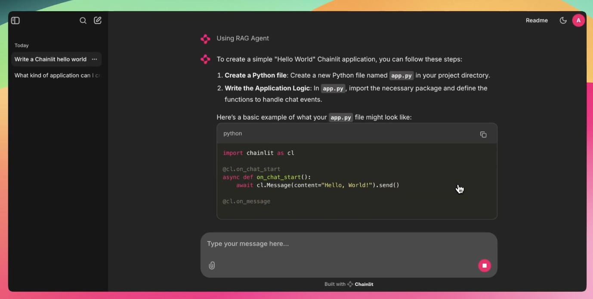
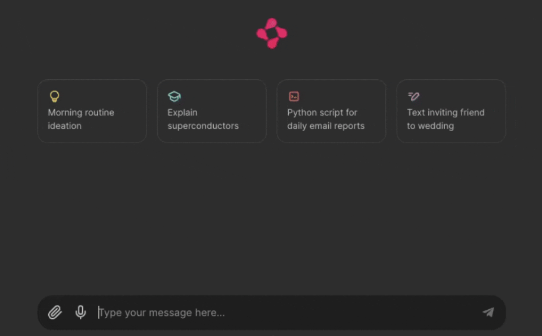
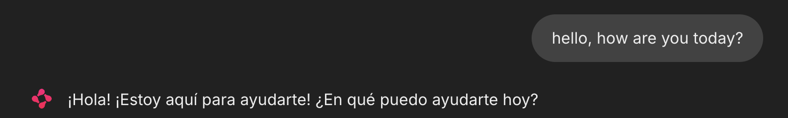
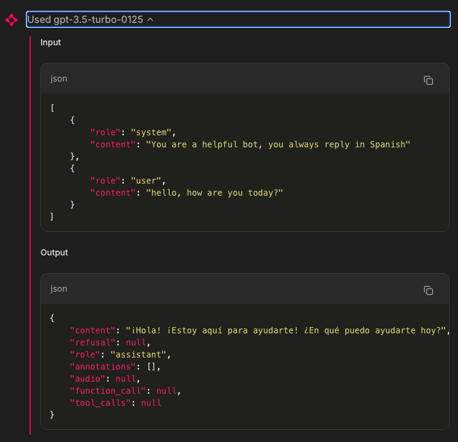

# Chainlit

Chainlit is an open-source Python package to build production ready Conversational AI.

## Intro
Key features
- Build fast: Get started in a couple lines of Python
- Authentication: Integrate with corporate identity providers and existing authentication infrastructure
- Data persistence: Collect, monitor and analyze data from your users
- Visualize multi-steps reasoning: Understand the intermediary steps that produced an output at a glance
- Multi Platform: Write your assistant logic once, use everywhere

Chainlit is compatible with all Python programs and libraries. That being said, it comes with a set of integrations with popular libraries and frameworks:
- langchain
- openai
- mistralai
- autogen
- llama index

## Installation
```bash
pip install chainlit
```

or
```bash
uv add chainlit
```

## Usage
Run the Chainlit app in watch mode:
```bash
chainlit run <app> -w
```

## Chat Lifecycle
Whenever a user connects to your Chainlit app, a new chat session is created. A chat session goes through a life cycle of events, which you can respond to by defining hooks.

### 1. ​On Chat Start
The `on_chat_start` decorator is used to define a hook that is called when a new chat session is created.

```python
@cl.on_chat_start
def on_chat_start():
    print("A new chat session has started!")
```

### 2. On Message
The `on_message` decorator is used to define a hook that is called when a new message is received from the user.
```python
@cl.on_message
def on_message(msg: cl.Message):
    print("The user sent: ", msg.content)
```

### 3. On Stop
The `on_stop` decorator is used to define a hook that is called when the user clicks the stop button while a task was running.
```python
@cl.on_stop
def on_stop():
    print("The user wants to stop the task!")
```

### 4. On Chat End
The `on_chat_end` decorator is used to define a hook that is called when the chat session ends either because the user disconnected or started a new chat session.
```python
@cl.on_chat_end
def on_chat_end():
    print("The user disconnected!")
```

### 5. On Chat Resume
The on_chat_resume decorator is used to define a hook that is called when a user resumes a chat session that was previously disconnected. This can only happen if authentication and data persistence are enabled.
```python
from chainlit.types import ThreadDict

@cl.on_chat_resume
async def on_chat_resume(thread: ThreadDict):
    print("The user resumed a previous chat session!")
```

## Starters
Starters are suggestions to help your users get started with your assistant.
```python
import chainlit as cl

@cl.set_starters
async def set_starters():
    return [
        cl.Starter(
            label="Morning routine ideation",
            message="Can you help me create a personalized morning routine that would help increase my productivity throughout the day? Start by asking me about my current habits and what activities energize me in the morning.",
            icon="/public/idea.svg",
            ),

        cl.Starter(
            label="Explain superconductors",
            message="Explain superconductors like I'm five years old.",
            icon="/public/learn.svg",
            ),
        cl.Starter(
            label="Python script for daily email reports",
            message="Write a script to automate sending daily email reports in Python, and walk me through how I would set it up.",
            icon="/public/terminal.svg",
            ),
        cl.Starter(
            label="Text inviting friend to wedding",
            message="Write a text asking a friend to be my plus-one at a wedding next month. I want to keep it super short and casual, and offer an out.",
            icon="/public/write.svg",
            )
        ]
# ...
```
This is how the 4 `Starter` above look like:



## Message
A Message is a piece of information that is sent from the user to an assistant and vice versa. Coupled with life cycle hooks, they are the building blocks of a chat.

A message has a content, a timestamp and cannot be nested.

​### Example: Reply to a user message
Lets create a simple assistant that replies to a user message with a greeting.
```python
import chainlit as cl

@cl.on_message
async def on_message(message: cl.Message):
    response = f"Hello, you just sent: {message.content}!"
    await cl.Message(response).send()
```


### Chat Context
Since LLMs are stateless, you will often have to accumulate the messages of the current conversation in a list to provide the full context to LLM with each query.

You could do that manually with the `user_session`. However, Chainlit provides a built-in way to do this:
```python
import chainlit as cl

@cl.on_message
async def on_message(message: cl.Message):
    # Get all the messages in the conversation in the OpenAI format
    print(cl.chat_context.to_openai())

    # Send the response
    response = f"Hello, you just sent: {message.content}!"
    await cl.Message(response).send()
```

Every message sent or received will be automatically accumulated in cl.chat_context. You can then use `cl.chat_context.to_openai()` to get the conversation in the OpenAI format and feed it to the LLM.


```
---
## Demo scripts

### OpenAI Integration english to Spanish Translation
This app shows how to use an Openai model, in this case `gpt-3.5-turbo`

```bash
chainlit run app/app_openai_translate.py -w
```

Prompt Example:


Input and Output:


## More resources
- **Documentation:** Get started with our comprehensive [Chainlit Documentation](https://docs.chainlit.io) 📚
- **Discord Community:** Join our friendly [Chainlit Discord](https://discord.gg/k73SQ3FyUh) to ask questions, share your projects, and connect with other developers! 💬

- [Chainlit Cookbook](https://github.com/Chainlit/cookbook)
- [AWS Foundational LLM Chat with Chainlit](https://github.com/aws-samples/foundational-llm-chat)
- [Building a chat app with chainlit and Bedrock](https://www.linkedin.com/pulse/building-chat-application-chainlit-amazon-bedrock-chris-kaspar-jq56c/)